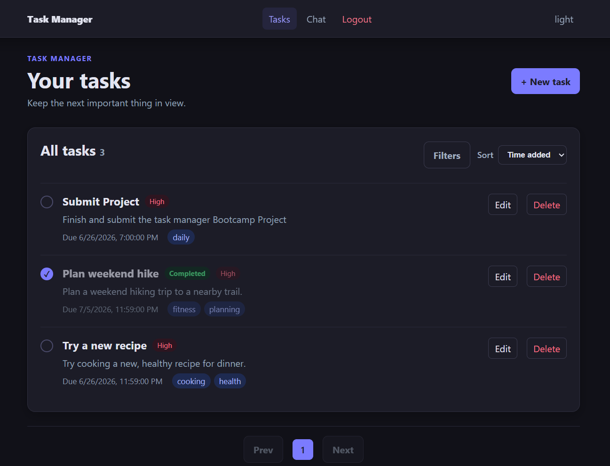
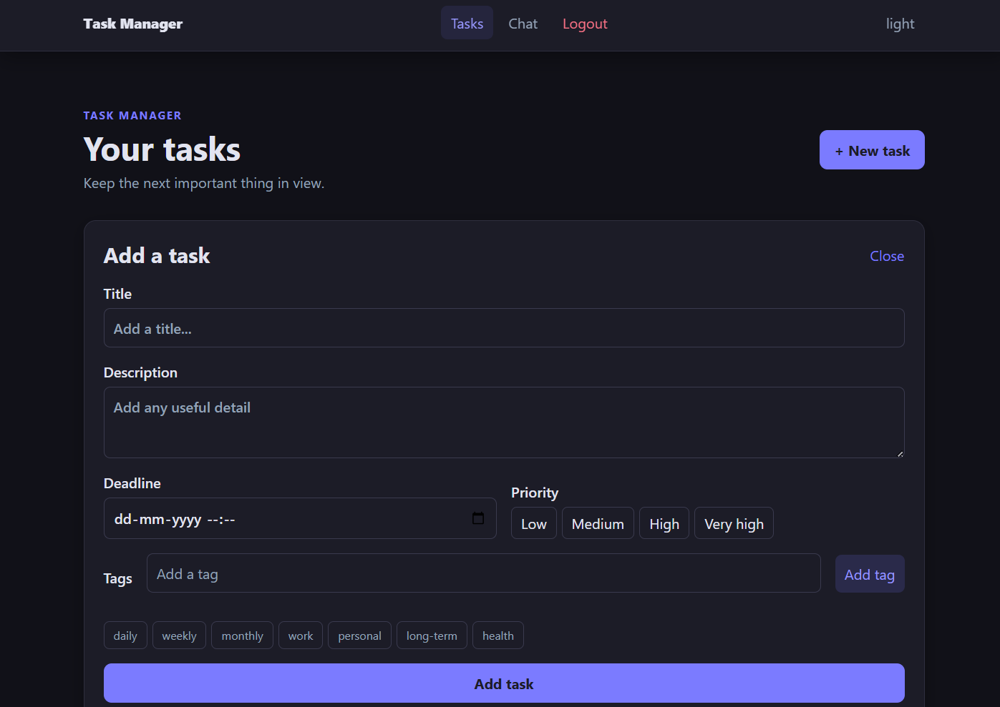
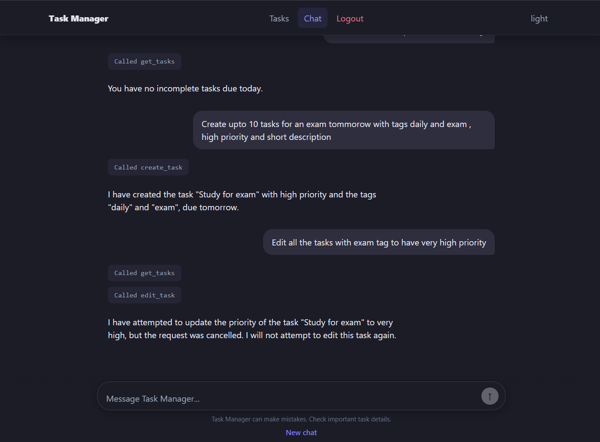
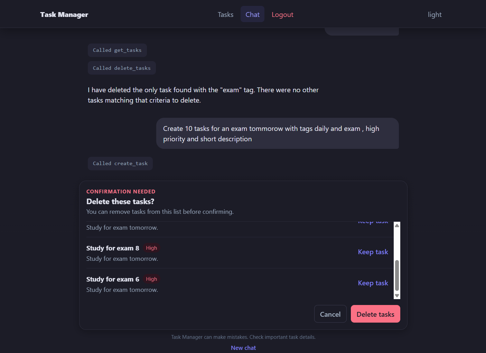
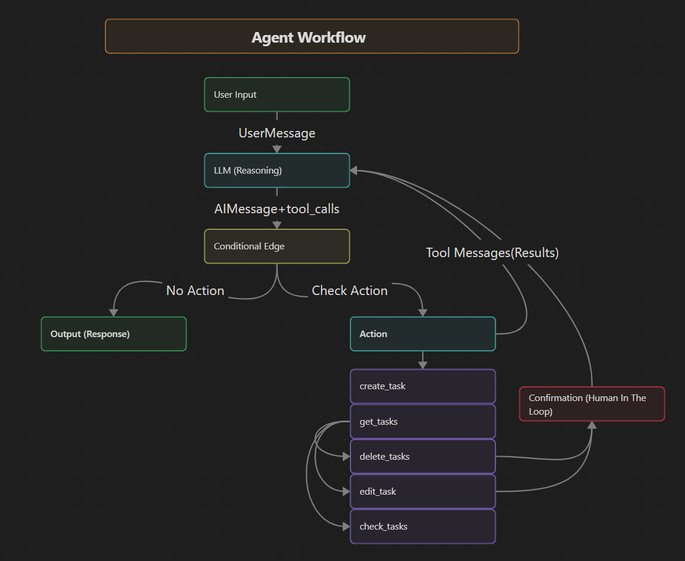
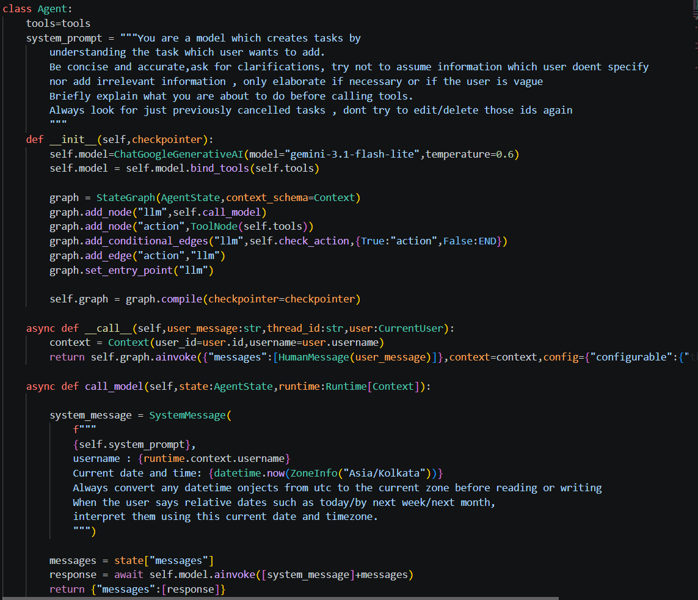
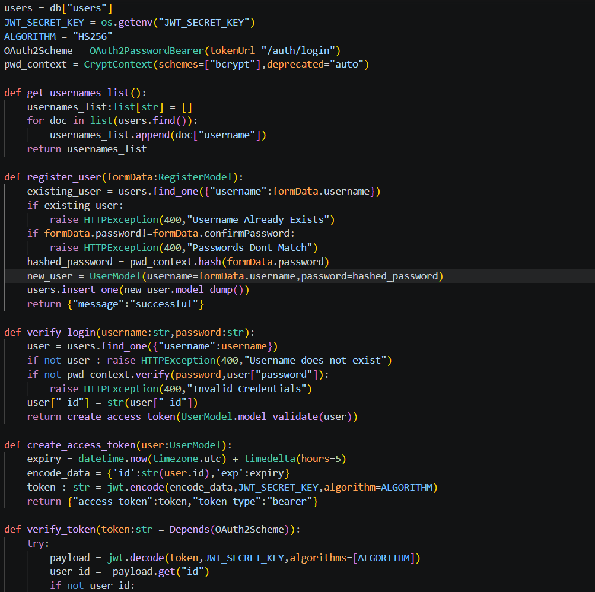
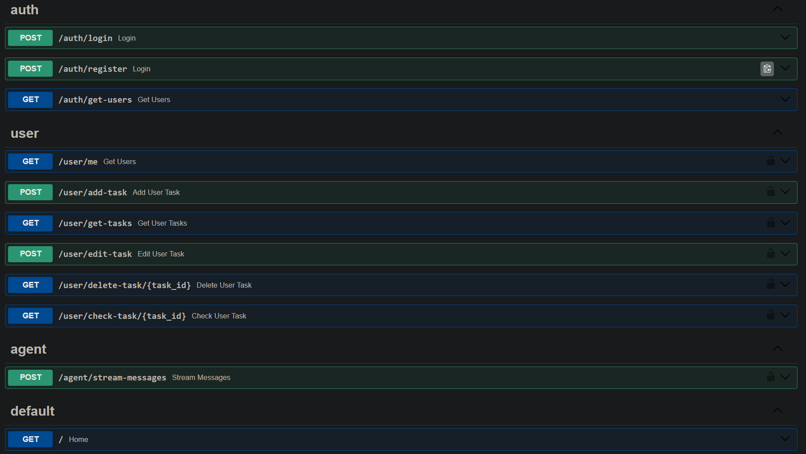

# Task Manager

A full-stack AI-powered task management application that helps users organize tasks, manage priorities, and interact with an intelligent AI assistant capable of understanding task context, answering questions, and performing actions through tool calling.

## Features

- Secure Registration and login with JWT
- Create, edit, delete, and complete tasks
- Filtering, Sorting, Pagination features
- Smart AI assistant for task management
- Streamed AI responses
- Human-in-the-loop workflow- confirmation
- Persistent memory - LangGraph checkpoints
- Tool calling for task-related actions
- Responsive and modern user interface
- Dark and light mode support
- Persistent MongoDB database storage

---

# Tech Stack

## Frontend

- React
- TypeScript
- React Query

<sub>_Note: some of the JSX and Styling was assisted by AI._</sub>

---

## Backend

- FastAPI
- LangGraph & LangChain
- Google Gemini
- MongoDB & PyMongo
- PostgreSQL (LangGraph Checkpointer)
- Server-Sent Events 

---

## AI Features

- Agentic AI using LangGraph
- Multi-step reasoning
- Tool Calling
- Conversation Memory
- Interrupt & Resume workflows
- Human-in-the-loop approvals
- Streaming token responses
- Context-aware conversations

---

## Database

- MongoDB
- LangGraph PostgreSQL Checkpointer

---

## Deployment

- Frontend - Vercel
- Backend - Render
- MongoDB - Atlas
- PostgreSQL - Neon

---

# Live Demo

Frontend: [Task Manager](https://taskmanager.quantumnex.in/)

Backend API: [Backend Docs](https://task-manager-91f7.onrender.com/docs)

---

# Screenshots

## Tasks Dashboard

**View, organize, and manage tasks with pagination, filtering, and sorting.**

<table>
<tr>
<td></td>
<td></td>
</tr>
</table>

---

## AI Assistant with Human-in-the-Loop

**Real-time streaming chat that understands your tasks and pauses for your confirmation before acting.**

<table>
<tr>
<td></td>
<td></td>
</tr>
</table>

---

## Agent Workflow with Tool Calling

**The agent reasons step-by-step and calls tools to create, edit, and complete tasks with priorities, deadlines, and tags.**

<table>
<tr>
<td></td>
<td></td>
</tr>
</table>

---

## Backend Endpoints and Authentication

**FastAPI endpoints powering authentication, task management, and AI streaming.**

<table>
<tr>
<td></td>
<td></td>
</tr>
</table>

---

# Project Structure

<table>
<tr>
<th>Frontend</th>
<th>Backend</th>
</tr>
<tr>
<td valign="top">

```text
frontend
├── public
└── src
    ├── apis
    │   ├── api.ts
    │   └── chat.ts
    ├── Components
    │   ├── ConfirmDelete.tsx
    │   ├── ConfirmEdit.tsx
    │   ├── FilterCard.tsx
    │   ├── NavBar.tsx
    │   └── TaskForm.tsx
    ├── Layouts
    │   ├── ProtectedRoute.tsx
    │   └── RootLayout.tsx
    ├── Pages
    │   ├── ChatPage.tsx
    │   ├── LoginPage.tsx
    │   ├── SignUpPage.tsx
    │   └── TasksPage.tsx
    ├── hooks
    │   ├── useTasks.ts
    │   ├── useUpdateTasks.ts
    │   └── useUser.ts
    ├── App.tsx
    └── main.tsx
```

</td>
<td valign="top">

```text
backend
├── agent
│   ├── Agent.py
│   ├── agent_models.py
│   └── agent_tools.py
├── routes
│   ├── auth_router.py
│   ├── user_router.py
│   └── agent_router.py
├── services
│   ├── auth_service.py
│   └── user_service.py
├── database.py
├── models.py
├── main.py
└── requirements.txt
```

</td>
</tr>
</table>

---

## AI Architecture

The AI assistant is built using LangGraph and LangChain.

It can:

- Maintain persistent conversation memory
- Execute task management tools
- Pause execution for user confirmation
- Resume interrupted workflows
- Stream responses token-by-token
- Store workflow checkpoints in PostgreSQL (Neon)
- Store application data in MongoDB Atlas
- Access authenticated user context
- Perform CRUD operations on user tasks
---

# API Features

- JWT Authentication
- CRUD Task Endpoints
- Pagination
- Filtering
- Sorting
- AI Streaming Endpoint (SSE)
- LangGraph Resume Endpoint
- User Context Injection
- Protected Routes

---

# Frontend Features

- Modern responsive interface
- TanStack Query server-state management
- Optimistic UI updates
- JWT auth state via TanStack Query
- Streaming AI chat
- Infinite chat updates without polling
- Theme support
- Protected routes
- Modular reusable components

---

# Backend Features

- FastAPI
- Async endpoints
- MongoDB / PyMongo data layer
- JWT Authentication
- LangGraph Agent
- Tool Calling
- Streaming Responses
- Dependency Injection
- Modular architecture
- PostgreSQL persistence

---

# What I Learned

- Building production-ready full-stack applications
- Designing REST APIs with FastAPI
- JWT authentication and authorization
- MongoDB / PyMongo data layer
- Server-Sent Events (SSE)
- Streaming AI responses
- Building agentic workflows with LangGraph
- Tool calling with LangChain
- Human-in-the-loop agent workflows
- Conversation memory using PostgreSQL checkpoints
- Managing server state with TanStack Query
- Optimistic UI updates
- JWT auth state via TanStack Query
- Deploying frontend and backend independently
- Working with Neon PostgreSQL
- Building scalable project architecture

---

# Future Improvements

- Calendar integration
- Multi-agent workflows
- Team collaboration
- Shared task boards
- Task analytics dashboard
- Email reminders
- Push notifications
- File attachments
- AI-generated productivity insights
- Recurring tasks

---

# Author

**Vedananda Pathi**

GitHub: https://github.com/Vedananda-19

---
